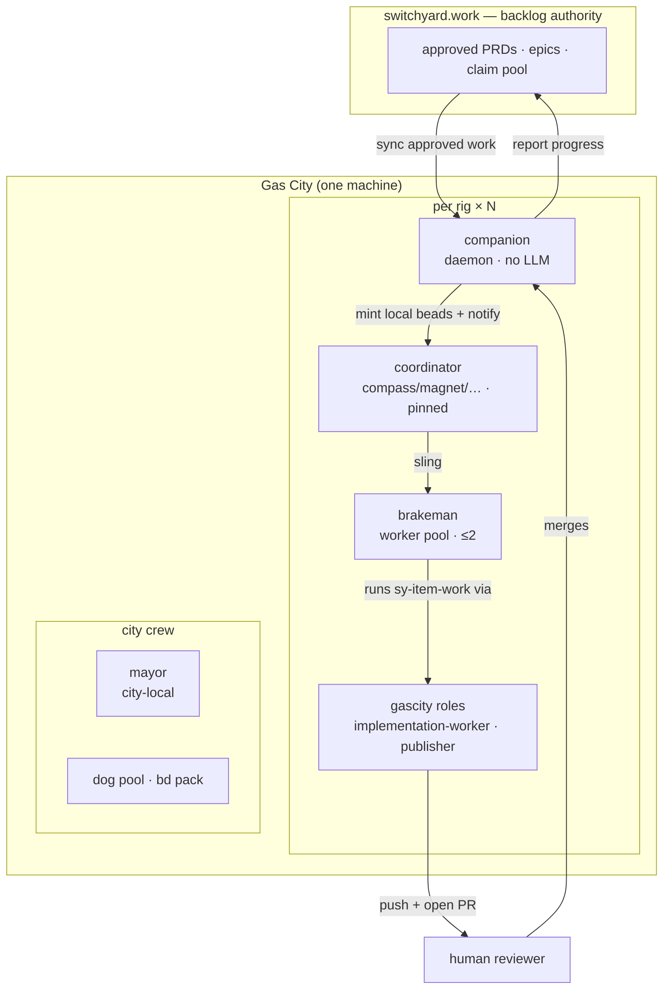

# Gas City packs

Packs for running a Gas City whose backlog authority is **switchyard**. Nothing
here names a rig, an agent, or a machine — any Gas City can import these.

They live in this repo, next to the server they drive, so a pack can never skew
from the API it calls. Pin a switchyard commit and you have pinned the server,
the MCP tool surface, and the orders that use them, together.

> **`switchyard-ops` and `switchyard-build` are retired.** Layer 3 — the 24-hour
> heartbeat of timed orders, the `brakeman` worker pool, and the judge / answerer
> / reviewer / intake-triage / dupe-scout / golden-journey lanes — shipped as
> `switchyard-ops`. Two of its lanes could not run without a
> `switchyard-companion` binary installed alongside, and the pack went with the
> companion. `switchyard-build`, the factory build/publish workflow, resolved its
> per-item fan-out decomposer out of `switchyard-ops`, so it went too rather than
> be left naming an import that resolves to nothing.
>
> **Their replacement is [switchyard-conductor](https://github.com/outdoorsea/switchyard-conductor)**,
> which runs every one of those lanes under its own process supervision: it needs
> no city, no `gc`, no order schedule and no roster.
>
> What remains here is the MCP overlay, which gives a rig's existing crew the
> switchyard tools. It is a pure enhancement pack — it declares no imports and
> inherits nothing — so the repo now has **no derived pack**, and the
> derived-pack compatibility and importability gates were removed with their only
> subject. A new derived pack needs them back.

```
packs/onboarding/         first-run: pick your surface, connect it, drive switchyard
packs/switchyard-mcp/     Layer 2 — overlay: switchyard MCP into a rig's crew
packs/examples/city/      a reference pack.toml + city.toml to copy
packs/docs/OPERATING-MODEL.md   roles, layering, token economy, gotchas
packs/docs/TOKEN-HARDENING.md   keep an idle fleet from paying to idle
packs/docs/LOOP.md              the 24-hour cadence and escalation discipline
```

**Setting up for the first time — any surface (single terminal, Claude Code,
OpenAI desktop, Gas City)?** Start at [`onboarding/`](onboarding/README.md): one
shared operating manual ([`AGENTS.md`](onboarding/AGENTS.md)) plus a per-client
"register the MCP server" page.

For the Gas City design of record, read
[`docs/OPERATING-MODEL.md`](docs/OPERATING-MODEL.md), then copy
[`examples/city/`](examples/city/README.md).

## Roles at a glance

Work flows in one loop: **switchyard → local runtime → coordinator → worker →
pull request → human merge → back to switchyard.** The switchyard cloud is the
backlog authority; everything else is a role on the machine that runs the work.



| Role | Layer | LLM? | Lifecycle | Job |
|---|---|:--:|---|---|
| **switchyard** | cloud | — | — | PRDs, epics, the claim pool — the source of truth |
| **companion** | per-rig bridge | no | daemon | sync approved PRDs → local beads; report progress up |
| **coordinator** (compass/magnet/…) | per-rig | yes | **pinned** | triage the rig's switchyard project; sling work to the pool |
| **brakeman** | per-rig | yes | on-demand pool (≤2) | claim a bead → build in a scoped worktree → push → open a PR |
| **answerer** | per-rig | yes | on-demand | drain open PRD questions |
| **judge** | per-rig | yes — **independent model** | on-demand | drain the awaiting-validation backlog |
| gascity **roles** | per-rig | yes | stateless targets | `gc.implementation-worker`, `gc.publisher`, `gc.run-operator` — what a formula step dispatches to |
| **mayor** | city | yes | always-on | human interface, city coordination, **every escalation lands here** |
| **dog** | city | yes | on-demand pool | mechanical formula orders (stale-DB sweeps, GC) — from the `bd` pack |

**Nothing merges on its own.** A brakeman opens a pull request and stops; a human
merges it. There is no refinery in a gascity city.

**The judge does not share a brain with the workers.** The brakeman pool declares
no provider and so runs the city default; `agents/judge/agent.toml` pins
`provider = "deepseek"`, the same provider `security-scout` already requires, so
builder and validator reason on different models and a model's blind spot cannot
pass its own work. Identity independence — the judge's own agent ref, which the
server's separation-of-duties rules key on — is a separate and weaker property:
two refs can be one runtime. The server-side complement refuses a judgment whose
recorded runtime matches the builder's. Both halves, and the `[[patches.agent]]`
opt-out for a city that has not wired deepseek, are documented in that agent.toml.
The pin itself is held by the **`judge runtime-diversity self-test`** CI job
(`bash scripts/judge-runtime-diversity.test.sh`). A different runtime is only
half of independence, though — what the judge *does* with it is
[The judge: how a criterion gets read](#the-judge-how-a-criterion-gets-read).

**There is also no always-on watcher.** gastown's `witness`, `deacon` and `boot`
have no gascity equivalent, so a quiet city is much cheaper to run — and nothing
is watching for stuck beads or expired leases. That trade is spelled out in
[`docs/OPERATING-MODEL.md`](docs/OPERATING-MODEL.md#what-you-give-up); the
remaining idle cost (the mayor, plus one coordinator per rig) is the subject of
[`docs/TOKEN-HARDENING.md`](docs/TOKEN-HARDENING.md).

## Packs vs. the Claude Code plugin

[`plugins/switchyard/`](../plugins/switchyard) and these packs solve different
problems, and you may want both:

|  | `plugins/switchyard` | `packs/` |
|---|---|---|
| Consumer | any Claude Code session | agent sessions under `gc` |
| Gives you | `/switchyard:*` slash commands | MCP overlay + timed orders |
| Needs | Claude Code | a Gas City |

A human driving switchyard by hand wants the plugin. A city that runs
coordinators on a heartbeat wants the packs.

## Install

Packs are **authored here** and **consumed from the public mirror**,
[`outdoorsea/switchyard-packs`](https://github.com/outdoorsea/switchyard-packs) —
this repo is private, and `gc import` needs a git source it can clone
anonymously to resolve and lock a pin. `.github/workflows/mirror-packs.yml`
republishes `packs/` there on every push to `main`, byte-for-byte, so the
mirror's root is this directory's root and each pack is a top-level subpath.

The mirror is a projection, never a source. Send changes here.

**Standing up a whole NEW city with these packs** — scaffold, provider
declarations, the rig block, roster.conf (the step nothing prompts for), the
webhook, and the verification sequence — is written up as a runbook in
[docs/city-setup.md](../docs/city-setup.md), distilled from the second city
build with every friction point that run actually hit.

That runbook describes a DERIVED pack's pin discipline — a derived pack's nested
`gc` pin must match the consuming city's base pin, or `gc import install` refuses
it and the declared-but-uninstalled import rejects the whole city config. No pack
here is derived any more, so that section applies to nothing until one is.

```sh
# per rig: the MCP overlay, for each rig whose crew drives switchyard
gc import add https://github.com/outdoorsea/switchyard-packs/tree/main/switchyard-mcp --rig YOUR_RIG

gc import install
gc import check
```

`gc import add` writes the `[imports.*]` entry and locks the resolved commit
into `packs.lock`; see [`examples/city/`](examples/city/README.md) for the TOML
it produces.

Working on the packs themselves? Import your checkout directly. `gc` promotes a
path inside a git worktree to a `file://` source and locks it to the
checked-out commit, so a local import still pins:

```toml
source = "/path/to/switchyard/packs/switchyard-mcp"
```

## Requirements

- `gc` (Gas City), `jq`, `tmux`, `python3`
- the **gascity** pack imported (city scope) and **gascity/roles** per rig
- `gh` and/or `glab` on `PATH`, authenticated for each rig's repo host — the worker
  opens its own pull request, so a rig whose repo CLI is missing cannot publish
- `switchyard-mcp` on `PATH`, authenticated via `switchyard-mcp login`

The overlay ships **no token**. The MCP server resolves it from
`$SWITCHYARD_API_TOKEN` or a `chmod 600` machine-local token file. Never put a
token in `overlay/.claude/settings.json`.

### Install gascity's build-artifact validator — nothing does it for you

`sy-item-work` inherits gascity's `implement` step, which carries a hard
`mode = "exec"` check on `.gc/scripts/checks/build-artifact-valid.sh` with
`max_attempts = 3`. **That file is not installed by `gc import install`, by
`gc rig add`, or by the supervisor reconcile.** `.gc/scripts` is a *projection of
the city's own `.gc/scripts` directory* into each agent worktree, not a
pack-asset installer (the `ResolveScripts` shim that once did this was removed),
and gascity's README documents no install step. Miss it and every implement step
fails its check three times — on work that may well have been fine.

Install it into **each rig root**, not the city root. gascity's role agents
(`gc.run-operator`, `gc.implementation-worker`, `gc.publisher`) declare no
`work_dir`, so they execute with their cwd at the **rig root** — and the check
path is relative, so that is where it resolves. gc projects `.gc/settings.json`
into that directory but **not** `.gc/scripts`, so a city-root copy is never
consulted. Preserve the layout: `validate_build_artifact.py` resolves schemas as
`parents[2]/schemas/build`, so one directory off fails as "schema not found",
which reads like a formula bug rather than a copy error.

```sh
# Locate the gascity pack cache the city ACTUALLY resolves. Derive it from the
# formula search paths rather than guessing at ~/.gc/cache: that directory is
# keyed by a hash of the source URL, so several gascity copies can coexist at the
# same commit and only one is the one your rig loads.
# (There is no `gc pack list --json` — that command declares no JSON support.)
GASCITY=$(dirname "$(gc formula show implementation-base --rig <rig> --json \
  | jq -r '.search_paths[] | select(endswith("/gascity/formulas"))')")

RIG=/path/to/rig-checkout
mkdir -p "$RIG/.gc/scripts/checks" "$RIG/schemas"
cp "$GASCITY"/assets/scripts/checks/*.sh "$RIG/.gc/scripts/checks/"
cp "$GASCITY"/assets/scripts/*.py        "$RIG/.gc/scripts/"
chmod +x "$RIG/.gc/scripts/checks/"*.sh
cp -R "$GASCITY/schemas/build" "$RIG/schemas/"

# Keep the runtime out of the product repo's history — a worker running
# `git add -A` would otherwise commit it.
printf '\n.gc/\nschemas/build/\n' >> "$RIG/.gitignore"
```

Verify from the rig root — the cwd the check actually runs in — rather than
assuming the copy worked:

```sh
cd "$RIG"
printf -- '---\nschema: gc.build.implementation-summary.v1\n---\n' > /tmp/a.md
python3 .gc/scripts/validate_build_artifact.py \
  --schema gc.build.implementation-summary.v1 --path /tmp/a.md
# want: "front matter missing required fields: [...]"  (schema LOADED, content bad)
# not:  anything mentioning the schema itself being missing
```
