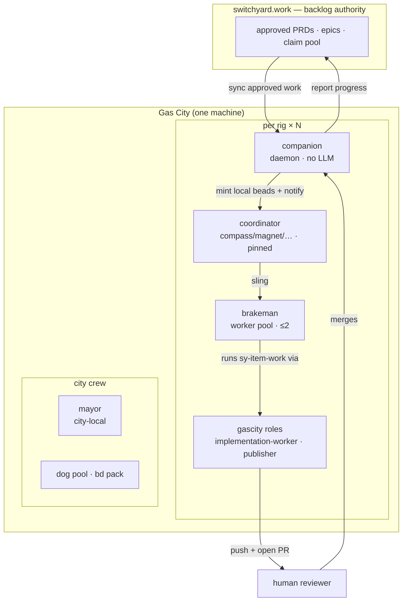

# Gas City packs

Packs for running a Gas City whose backlog authority is **switchyard**. Nothing
here names a rig, an agent, or a machine — any Gas City can import these.

They live in this repo, next to the server they drive, so a pack can never skew
from the API it calls. Pin a switchyard commit and you have pinned the server,
the MCP tool surface, and the orders that use them, together.

```
packs/onboarding/         first-run: pick your surface, connect it, drive switchyard
packs/switchyard-ops/     Layer 3 — the city's 24-hour heartbeat (timed orders)
                                  + brakeman (workers), answerer, judge
                                  + sy-item-work, the build+publish formula
packs/switchyard-mcp/     Layer 2 — overlay: switchyard MCP into a rig's crew
packs/examples/city/      a reference pack.toml + city.toml to copy
packs/docs/OPERATING-MODEL.md   roles, layering, token economy, gotchas
packs/docs/TOKEN-HARDENING.md   keep an idle fleet from paying to idle
packs/docs/LOOP.md              the 24-hour cadence and escalation discipline
```

**Setting up for the first time — any surface (single terminal, Claude Code,
OpenAI desktop, Gas City)?** Start at [`onboarding/`](onboarding/README.md): one
shared operating manual ([`AGENTS.md`](onboarding/AGENTS.md)) plus a per-client
"register the MCP server" page.

For the Gas City design of record, read
[`docs/OPERATING-MODEL.md`](docs/OPERATING-MODEL.md), then copy
[`examples/city/`](examples/city/README.md).

## Roles at a glance

Work flows in one loop: **switchyard → companion → coordinator → worker → pull
request → human merge → back to switchyard.** The switchyard cloud is the backlog
authority; everything else is a role in the local Gas City.



| Role | Layer | LLM? | Lifecycle | Job |
|---|---|:--:|---|---|
| **switchyard** | cloud | — | — | PRDs, epics, the claim pool — the source of truth |
| **companion** | per-rig bridge | no | daemon | sync approved PRDs → local beads; report progress up |
| **coordinator** (compass/magnet/…) | per-rig | yes | **pinned** | triage the rig's switchyard project; sling work to the pool |
| **brakeman** | per-rig | yes | on-demand pool (≤2) | claim a bead → build in a scoped worktree → push → open a PR |
| **answerer** | per-rig | yes | on-demand | drain open PRD questions |
| **judge** | per-rig | yes — **independent model** | on-demand | drain the awaiting-validation backlog |
| gascity **roles** | per-rig | yes | stateless targets | `gc.implementation-worker`, `gc.publisher`, `gc.run-operator` — what a formula step dispatches to |
| **mayor** | city | yes | always-on | human interface, city coordination, **every escalation lands here** |
| **dog** | city | yes | on-demand pool | mechanical formula orders (stale-DB sweeps, GC) — from the `bd` pack |

**Nothing merges on its own.** A brakeman opens a pull request and stops; a human
merges it. There is no refinery in a gascity city.

**The judge does not share a brain with the workers.** The brakeman pool declares
no provider and so runs the city default; `agents/judge/agent.toml` pins
`provider = "kimi"`, the same provider `security-scout` already requires, so
builder and validator reason on different models and a model's blind spot cannot
pass its own work. Identity independence — the judge's own agent ref, which the
server's separation-of-duties rules key on — is a separate and weaker property:
two refs can be one runtime. The server-side complement refuses a judgment whose
recorded runtime matches the builder's. Both halves, and the `[[patches.agent]]`
opt-out for a city that has not wired kimi, are documented in that agent.toml.

**There is also no always-on watcher.** gastown's `witness`, `deacon` and `boot`
have no gascity equivalent, so a quiet city is much cheaper to run — and nothing
is watching for stuck beads or expired leases. That trade is spelled out in
[`docs/OPERATING-MODEL.md`](docs/OPERATING-MODEL.md#what-you-give-up); the
remaining idle cost (the mayor, plus one coordinator per rig) is the subject of
[`docs/TOKEN-HARDENING.md`](docs/TOKEN-HARDENING.md).

## Packs vs. the Claude Code plugin

[`plugins/switchyard/`](../plugins/switchyard) and these packs solve different
problems, and you may want both:

|  | `plugins/switchyard` | `packs/` |
|---|---|---|
| Consumer | any Claude Code session | agent sessions under `gc` |
| Gives you | `/switchyard:*` slash commands | MCP overlay + timed orders |
| Needs | Claude Code | a Gas City |

A human driving switchyard by hand wants the plugin. A city that runs
coordinators on a heartbeat wants the packs.

## Install

Packs are **authored here** and **consumed from the public mirror**,
[`outdoorsea/switchyard-packs`](https://github.com/outdoorsea/switchyard-packs) —
this repo is private, and `gc import` needs a git source it can clone
anonymously to resolve and lock a pin. `.github/workflows/mirror-packs.yml`
republishes `packs/` there on every push to `main`, byte-for-byte, so the
mirror's root is this directory's root and each pack is a top-level subpath.

The mirror is a projection, never a source. Send changes here.

```sh
# city-wide, ONCE: the heartbeat orders AND a brakeman pool in every rig
gc import add https://github.com/outdoorsea/switchyard-packs/tree/main/switchyard-ops

# per rig: the MCP overlay, for each rig whose crew drives switchyard
gc import add https://github.com/outdoorsea/switchyard-packs/tree/main/switchyard-mcp --rig YOUR_RIG

gc import install
gc import check
```

**Import `switchyard-ops` at city scope only.** One city import yields both the
orders *and* a `brakeman` pool in every rig — `gc` expands a pack's rig-scoped
agents into each rig from the city import. Adding `--rig` on top registers every
order a second time under that rig, so `loop-health` and `intake-sweep` nudge
twice per cycle and mail the mayor twice per escalation.

Measured on a 14-rig city:

| Import scope | `brakeman` agents | order registrations |
|---|---|---|
| city only | 14 | 1 |
| rig only | 1 | 1 (that rig) |
| both | 14 | **2** |

To keep workers out of a rig, suspend the agent there rather than withholding
the import:

```toml
[[patches.agent]]
  dir = "<rig>"
  name = "brakeman"
  suspended = true
```

`gc import add` writes the `[imports.*]` entry and locks the resolved commit
into `packs.lock`; see [`examples/city/`](examples/city/README.md) for the TOML
it produces.

Working on the packs themselves? Import your checkout directly. `gc` promotes a
path inside a git worktree to a `file://` source and locks it to the
checked-out commit, so a local import still pins:

```toml
source = "/path/to/switchyard/packs/switchyard-ops"
```

## What `switchyard-ops` gives you

The pack's mechanical orders, run directly by the controller as `exec` scripts
(no dog pool needed — that is only for *formula* orders), under one invariant:
**every silent failure becomes mail to the mayor within one order cycle.**

This table is the full manifest — [`docs/LOOP.md`](docs/LOOP.md) carries only the
subset that drives the loop itself and points here for the rest. Cadences are the
pack defaults; a city overrides any of them in `city.toml`. Rows are in cadence
order, so no count is written down: one drifted from the table it summarised for
eight orders, and a number in prose is the part nobody updates.

| Order | Every | Purpose |
|---|---|---|
| `pool-spawn` | 1m | Spawn one brakeman per rig with claimable pool demand and a free WIP slot, then direct-assign it the demand bead |
| `publish-gate` | 5m | Report worker beads that reached *closed* carrying no pull request |
| `pane-stall` | 10m | Report sessions idling with unsubmitted text on their input line — a stall no liveness check can see |
| `answer-sweep` | 20m | Keep one answerer alive per rig whose open-question queue is non-empty; reaps its own finished sessions first |
| `judge-sweep` | 30m | Keep one judging-validator alive per rig whose judgment queue is non-empty; reaps its own finished sessions first |
| `loop-health` | 30m | Pinned coordinators alive; escalate when the status probe lies |
| `pr-gate` | 30m | Report open item PRs aging past the review SLA, and integration PRs awaiting PRD acceptance |
| `intake-sweep` | 4h | Nudge coordinators to triage their switchyard project |
| `stray-reaper` | 6h | Sessions rooted at a stale city path |
| `config-drift` | 6h | Config-as-code guard (no-ops if the city isn't a git repo) |
| `scratch-reaper` | 6h | Report/prune orphaned `gc`-scratch dirs left at the city root — drained sessions' `work_dir`s, gated so a live one is never removed |
| `token-spike-watch` | 6h | Mail the mayor when a day's token usage exceeds the prior-day median by the configured factor (mechanical, no LLM) |
| `security-scan` | 12h | Start one security-scout per rig on an independent model; it files findings and opens PRs for high-severity only |
| `disk-watch` | 12h | Mail the mayor when a worktree/backup/`.gc`/event-log path crosses a size threshold |
| `events-rotate` | 24h | Cap `.gc/events.jsonl` to a recent tail (gc ships no retention for it) |
| `nightly-retro` | 24h | Daily reports + improvement candidates |
| `refactor-scan` | 168h | Start one refactor-scout per rig weekly; it files evidence-ranked refactor proposals and writes no code |
| `token-audit` | 168h | Start the city token auditor weekly; it attributes spend to agents/rigs and files findings |

### The sweep lanes reap what they spawn

`judge-sweep` and `answer-sweep` are the two *self-directed* lanes: their queue is
switchyard's, not the gc bead ledger, so there is no demand bead to route and
nothing to hand off — only a session to start. Both run the same script
(`assets/scripts/lane-ensure.sh <agent> <subject>`), and a cycle is
**reap-then-spawn**, in that order.

The ordering is load-bearing in both directions. Reaping first means the
"is one already running?" guard is answered by a roster that no longer holds
finished sessions; spawning after means a lane whose only session was just reaped
is refilled in the same cycle rather than left unowned until the next one.

Four gates stand between a cycle and a spawn, and each fails in a chosen
direction:

| Gate | Withholds the spawn when | On an unreadable answer |
|---|---|---|
| rig has this lane's agent | the agent is not defined for the rig | falls back to the coordinator set |
| rig not suspended | `gc rig suspend` names it | **spawns** — an unreadable `gc rig list` withholds nothing |
| no live session already | one is already running | **does not spawn** — never stack a second |
| lane queue non-empty | the queue is a confident `0` | **spawns** — only a confident zero withholds |

A suspended rig is skipped for the *spawn* but still **reaped**: `gc rig suspend`
tells the reconciler not to start that rig's agents, which is not a reason to
retain one that has already finished. Skipping the rig outright would open a
fresh retention hole in the change that exists to close them.

**Reaping decides on tmux pane state, never age** (`assets/lib/pane-state.sh`).
`IDLE` and `exiting turn` are reapable; `esc to interrupt` and `Running` are live,
and live wins unconditionally — scrollback is history, not state, so a capture
holding both markers is live. Every uncertainty resolves to *leave it running*:
empty, unreadable, unparseable and simply unrecognised captures all classify
`live`. The two errors are not symmetrical. Failing to reap costs one retained
session until the next cycle; reaping a live agent destroys in-flight work
irrecoverably. Age was tried and it killed live agents — it misclassified 4 of 12
sessions, one of them holding an unread mayor escalation — because a long
thinking turn emits nothing for minutes and looks exactly like an idle session.

Only sessions **this sweep spawned** may be reaped: the predicate matches the
literal `-adhoc-` segment gc puts in the name it gives a `lane_spawn` session, so
named and pinned roles (witness, refinery, conductor, mayor, deacon, boot) can
never match whatever their pane says. Note this is deliberately *stricter* than
the guard that decides whether to spawn — that one matches as broadly as it can,
because over-matching there only suppresses a spawn, while over-matching here
destroys a running agent's work. Same lane, same names, two identity tests on
purpose: do not unify them.

> **Not yet shipped:** teardown does **not** release a criterion claim the reaped
> session was holding (PRD #299 `crit:a6656bdb27fb`, still outstanding). A judge
> reaped mid-validation leaves its claim staked until the lease expires on its
> own. Reaping only closes the session.

### Published before closed

Review before merge used to be the hard part: gastown's refinery defaulted to
`direct` and would land an agent's unreviewed commit on your default branch, so
`merge-gate` existed to stamp `merge_strategy=mr` on every routed bead.

That risk is gone. Nothing merges by itself here — a brakeman opens a pull
request and stops. But the risk it was *really* covering, work reaching "done"
without a human ever seeing it, did not disappear. It moved.

gascity's worker lane closes its own bead, and its push/PR leg lives in a
separate formula whose `push` and `open_pr` vars **both default to `"false"`**.
So the new way work goes missing is: built, bead closed, branch never pushed —
and every switchyard surface reads it as delivered. Two things guard that:

1. **`sy-item-work` sequences `close-source-anchor` after `publish`**, and its
   close step refuses to run without a `pr_url` on the bead.
2. **`publish-gate`** reports any closed `*.brakeman` bead with no `pr_url`,
   because (1) is prose an agent can talk itself past.

`publish-gate` takes no configuration — `MERGE_STRATEGY` in `roster.conf` is now
inert and should be deleted when migrating. As before this is a backstop, not a
guarantee: **protect your default branch** so a worker that tries to push
straight to it fails loudly.

> **GitLab rigs work here.** The old refinery's `mr` mode shelled out to `gh`
> only, so a GitLab remote could not be handed off to at all. `sy-item-work`'s
> publish step resolves the forge from `git remote get-url origin` and uses `gh`
> or `glab` accordingly; an unrecognised host escalates to the mayor rather than
> closing the bead.

### Pruning scratch is a safety boundary

`scratch-reaper` is the one order that **deletes** anything, and its candidates
are not debris. Each is the `work_dir` of an ephemeral agent session, left behind
when that session drained — an ephemeral session derives its work_dir from its
scope root, so a city-scoped agent (the dog pool) lands directly in the city
root. A *running* session's work_dir has the identical shape, a directory holding
only `.gc/`, so "looks collectable" and "is a live agent" are the same
observation. Before the gates below existed it listed a running dog's working
directory under `SAFE TO REMOVE` with a copy-pasteable `rm -rf`, six processes
cwd'd inside.

So every removal clears three gates, and they fail in deliberately different
directions:

- **Ownership — the session records, fails closed.** `gc session list` projects
  each session's `gc.work_dir`; a directory that is (or contains) the work_dir of
  a session whose bead is not closed is never offered and never pruned, and comes
  back under `SKIPPED (live session)` naming its owner. The *record* is
  authoritative rather than process state, because an asleep session holds
  nothing open yet still owns its directory. When the roster can't be read —
  unparseable, or the lookup outruns `SCRATCH_REAPER_SESSION_TIMEOUT` (30s)
  against a wedged store — the directory is reported `UNVERIFIED`, never removed.
  A lookup that cannot be completed is not a licence to delete.
- **Occupancy — what is running inside, fails open.** This covers what the roster
  cannot: a live process left by a session whose bead has already closed. It is
  deliberately narrow, and that narrowness is the whole design. Only a process
  cwd'd at or below the directory, or one holding a descriptor on a path strictly
  *deeper*, counts (bounded by `SCRATCH_REAPER_LSOF_TIMEOUT`, 15s). A bare
  read-only handle on the directory's own inode does not: `gc supervisor` leaks
  those across the entire city root, and honouring them would make the reaper
  collect nothing for ever — a quieter broken reaper, not a fixed one. No `lsof`
  on the host simply means this probe contributes no signal; the gate that fails
  closed is the ownership one.
- **Freshness — re-checked at the instant of removal.** A scan-time verdict is
  already stale by the time a human reads the mail, so the report offers **no
  blanket `rm -rf`**. Each candidate comes back as a one-directory re-run
  (`SCRATCH_REAPER_PRUNE=1 SCRATCH_REAPER_ONLY=<dir> …/scratch-reaper.sh`) that
  re-reads the roster and re-tests the contents immediately before the `rm` and
  refuses anything that has come alive since. `SCRATCH_REAPER_PRUNE=1` on its own
  sweeps every candidate through that same re-check.

That is what makes `SCRATCH_REAPER_PRUNE=1` defensible to turn on. Both halves of
the contract are pinned by a hermetic self-test — a live session's work_dir
survives a prune run, *and* genuinely dead scratch is still collected, because a
gate that stops everything is a reaper that silently does nothing — run in CI as
the **`scratch-reaper self-test`** job (`bash scripts/scratch-reaper.test.sh`).

## Workers: the brakeman pool

`brakeman` is an elastic pool that claims a routed bead, builds it in a
bead-scoped worktree, pushes the branch and opens a pull request for it. It is
the thing you sling work to:

```sh
gc sling YOUR_RIG/switchyard-ops.brakeman ex-1234
```

Set `default_sling_targets` on the rig and a bare `gc sling ex-1234` lands in the
pool, so dispatch never has to name an agent.

### Nobody has to spawn the worker

Slinging a bead routes it; it does not start anyone. That second half rides gc's
controller (`scale_check` + sling-claim), and three defects there kill dispatch
*silently* — a molecule root that self-blocks reads as demand nothing can claim
(gff-56lh), a `scale_check` that will not spawn (gff-g8kr), and config-routed
beads nothing can claim (gff-fd33). A rig's queue then sits full while its pool
sits empty, with no error anywhere.

The `pool-spawn` order does that job itself instead of waiting on the controller.
Every minute it enumerates the non-suspended rigs and, for each one holding
demand a fresh brakeman could actually claim — open, routed to the pool,
unassigned, real work rather than a self-blocked root — with a free WIP slot, it
spawns exactly one brakeman via `gc session new --no-attach` and direct-assigns
that bead to the new session's adhoc identity, inside the start-pending window.
So a slung bead gets a worker within an order cycle, with no manual `gc session
new` and no dependence on the controller.

It is safe to run on a 1-minute cooldown because it is bounded and idempotent: at
most one brakeman per rig per cycle, never past the pool's `max_active_sessions`
(a session that is merely `start-pending` already occupies its slot), and it
re-verifies the target bead's current holder in the instant before the assign —
refusing whenever that holder's session is live, so it can never steal work from a
running worker. It mints no molecule root or workflow step, so a repeated run
leaves no wedged `in_progress` root behind. A spawn or assign that genuinely fails
— no session identity, a rejected assign, or a bead still unclaimed a full cycle
after hand-off — mails the mayor, per the pack invariant. A full pool is
saturation, not failure, and escalates nothing.

### No rig setting is required any more

If you are migrating a rig, **delete this line**:

```toml
[[rigs]]
  formula_vars = { binding_prefix = "gastown." }   # ← now inert; remove it
```

It was mandatory under the gastown lane. `{{binding_prefix}}` in
`mol-polecat-work` resolved to the import binding of the pack that *cooked* the
formula — `switchyard-ops` — so the submit step handed off to
`YOUR_RIG/switchyard-ops.refinery`, an agent nobody ships: the worker pushed its
branch, assigned to nobody, and the bead sat open with no reviewer. Silently.
(Found the hard way — a shadow run got as far as a pushed `polecat/<bead>`
branch before the handoff evaporated.)

There is no refinery and no handoff now; the worker opens its own PR. So the
landmine is gone rather than relocated, and the setting does nothing.

Concurrent sessions draw names from
[`agents/brakeman/namepool.txt`](switchyard-ops/agents/brakeman/namepool.txt) —
railway occupations: `fireman`, `switchman`, `shunter`, `hostler`, `carman`, …
The name identifies a *session*, not a specialty. Every brakeman claims from the
same queue. Keep at least `max_active_sessions` names in the pool.

The pool sits at `min_active_sessions = 0`: an idle worker is pure token burn,
and claims are cheap. It scales up on demand and drains back to nothing — the
scale-up being `pool-spawn`'s job, since gc's own `scale_check` cannot be relied
on to do it (see [Nobody has to spawn the worker](#nobody-has-to-spawn-the-worker)).

**A brakeman runs this pack's own `sy-item-work`.** It extends gascity's
`implementation-base` — inheriting `prepare-worktree`, `implement` and its
artifact check unchanged — and adds one step of its own:

```
prepare-worktree → implement → publish → close-source-anchor
```

We ship a formula rather than pointing brakeman at gascity's `do-work` for one
reason: `do-work` never pushes. Its terminal step closes the bead, and push/PR
live in gascity's separate `publish` formula, whose `push` and `open_pr` vars
both default to `"false"`. A worker on bare `do-work` would build the change,
close its bead, and leave the branch on local disk. So the publish step is
inserted *before* the close and the close depends on it — a bead cannot reach
closed without a pushed branch and an open PR.

Two consequences worth internalising if you know the gastown lane:

- **The worker closes its own bead now.** There is no refinery to do it. The old
  "never close an implementation bead" rule is inverted, not relaxed.
- **The branch name is no longer a wire contract.** `polecat/<bead-id>` mattered
  because the refinery validated it on handoff. Nothing validates it now, so the
  publish step just requires *some* per-item branch that is not the base branch.

The agent is ours, and now so is the method.

## No roster to maintain

The pack names no agent. `loop-health` and `intake-sweep` derive the coordinator
set from `gc agent list --json` — every agent with `pool.min >= 1` that is not
suspended. That is the reconciler's own intent, so the roster cannot drift from
config.

Only what `gc` cannot express goes in a **city-local, un-versioned**
`$GC_PACK_STATE_DIR/roster.conf` (see
[`roster.conf.example`](switchyard-ops/assets/roster.conf.example)):

- `PINNED_EXTRA` — singleton-alias agents that must stay `min=0` (pinning them
  spawns a twin that fights the alias) but still need liveness checks.
- `RETRO_AGENT` — who drafts the nightly report.
- `COORDINATORS` — override the sweep set.

With no `roster.conf` at all, everything still works.

## LLM instructions are assets, not strings

What a coordinator actually *does* during a sweep lives in
[`assets/prompts/`](switchyard-ops/assets/prompts), versioned and reviewable —
not buried in a shell heredoc. The scripts decide *who* to nudge; the prompts
decide *what* they do.

## Requirements

- `gc` (Gas City), `jq`, `tmux`, `python3`
- the **gascity** pack imported (city scope) and **gascity/roles** per rig
- `gh` and/or `glab` on `PATH`, authenticated for each rig's forge — the worker
  opens its own pull request, so a rig whose forge CLI is missing cannot publish
- `switchyard-mcp` on `PATH`, authenticated via `switchyard-mcp login`

The overlay ships **no token**. The MCP server resolves it from
`$SWITCHYARD_API_TOKEN` or a `chmod 600` machine-local token file. Never put a
token in `overlay/.claude/settings.json`.

### Install gascity's build-artifact validator — nothing does it for you

`sy-item-work` inherits gascity's `implement` step, which carries a hard
`mode = "exec"` check on `.gc/scripts/checks/build-artifact-valid.sh` with
`max_attempts = 3`. **That file is not installed by `gc import install`, by
`gc rig add`, or by the supervisor reconcile.** `.gc/scripts` is a *projection of
the city's own `.gc/scripts` directory* into each agent worktree, not a
pack-asset installer (the `ResolveScripts` shim that once did this was removed),
and gascity's README documents no install step. Miss it and every implement step
fails its check three times — on work that may well have been fine.

Install it into **each rig root**, not the city root. gascity's role agents
(`gc.run-operator`, `gc.implementation-worker`, `gc.publisher`) declare no
`work_dir`, so they execute with their cwd at the **rig root** — and the check
path is relative, so that is where it resolves. gc projects `.gc/settings.json`
into that directory but **not** `.gc/scripts`, so a city-root copy is never
consulted. Preserve the layout: `validate_build_artifact.py` resolves schemas as
`parents[2]/schemas/build`, so one directory off fails as "schema not found",
which reads like a formula bug rather than a copy error.

```sh
# Locate the gascity pack cache the city ACTUALLY resolves. Derive it from the
# formula search paths rather than guessing at ~/.gc/cache: that directory is
# keyed by a hash of the source URL, so several gascity copies can coexist at the
# same commit and only one is the one your rig loads.
# (There is no `gc pack list --json` — that command declares no JSON support.)
GASCITY=$(dirname "$(gc formula show implementation-base --rig <rig> --json \
  | jq -r '.search_paths[] | select(endswith("/gascity/formulas"))')")

RIG=/path/to/rig-checkout
mkdir -p "$RIG/.gc/scripts/checks" "$RIG/schemas"
cp "$GASCITY"/assets/scripts/checks/*.sh "$RIG/.gc/scripts/checks/"
cp "$GASCITY"/assets/scripts/*.py        "$RIG/.gc/scripts/"
chmod +x "$RIG/.gc/scripts/checks/"*.sh
cp -R "$GASCITY/schemas/build" "$RIG/schemas/"

# Keep the runtime out of the product repo's history — a worker running
# `git add -A` would otherwise commit it.
printf '\n.gc/\nschemas/build/\n' >> "$RIG/.gitignore"
```

Verify from the rig root — the cwd the check actually runs in — rather than
assuming the copy worked:

```sh
cd "$RIG"
printf -- '---\nschema: gc.build.implementation-summary.v1\n---\n' > /tmp/a.md
python3 .gc/scripts/validate_build_artifact.py \
  --schema gc.build.implementation-summary.v1 --path /tmp/a.md
# want: "front matter missing required fields: [...]"  (schema LOADED, content bad)
# not:  anything mentioning the schema itself being missing
```
