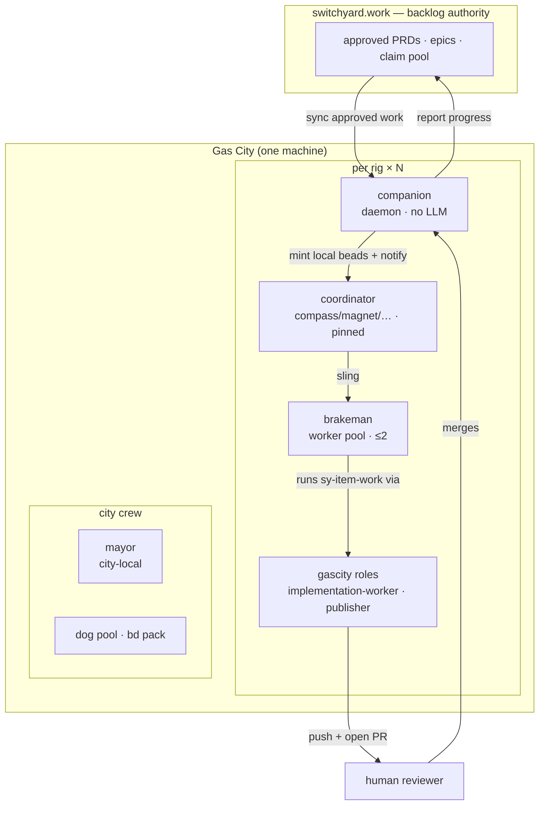

# Gas City packs

Packs for running a Gas City whose backlog authority is **switchyard**. Nothing
here names a rig, an agent, or a machine — any Gas City can import these.

They live in this repo, next to the server they drive, so a pack can never skew
from the API it calls. Pin a switchyard commit and you have pinned the server,
the MCP tool surface, and the orders that use them, together.

```
packs/onboarding/         first-run: pick your surface, connect it, drive switchyard
packs/switchyard-ops/     Layer 3 — the city's 24-hour heartbeat (timed orders)
                                  + brakeman (workers), answerer, judge
                                  + sy-item-work, the build+publish formula
                                  + template-fragments/, prompt sections shared
                                    across agents
packs/switchyard-mcp/     Layer 2 — overlay: switchyard MCP into a rig's crew
packs/examples/city/      a reference pack.toml + city.toml to copy
packs/docs/OPERATING-MODEL.md   roles, layering, token economy, gotchas
packs/docs/TOKEN-HARDENING.md   keep an idle fleet from paying to idle
packs/docs/LOOP.md              the 24-hour cadence and escalation discipline
```

**Setting up for the first time — any surface (single terminal, Claude Code,
OpenAI desktop, Gas City)?** Start at [`onboarding/`](onboarding/README.md): one
shared operating manual ([`AGENTS.md`](onboarding/AGENTS.md)) plus a per-client
"register the MCP server" page.

For the Gas City design of record, read
[`docs/OPERATING-MODEL.md`](docs/OPERATING-MODEL.md), then copy
[`examples/city/`](examples/city/README.md).

## Roles at a glance

Work flows in one loop: **switchyard → companion → coordinator → worker → pull
request → human merge → back to switchyard.** The switchyard cloud is the backlog
authority; everything else is a role in the local Gas City.



| Role | Layer | LLM? | Lifecycle | Job |
|---|---|:--:|---|---|
| **switchyard** | cloud | — | — | PRDs, epics, the claim pool — the source of truth |
| **companion** | per-rig bridge | no | daemon | sync approved PRDs → local beads; report progress up |
| **coordinator** (compass/magnet/…) | per-rig | yes | **pinned** | triage the rig's switchyard project; sling work to the pool |
| **brakeman** | per-rig | yes | on-demand pool (≤2) | claim a bead → build in a scoped worktree → push → open a PR |
| **answerer** | per-rig | yes | on-demand | drain open PRD questions |
| **judge** | per-rig | yes — **independent model** | on-demand | drain the awaiting-validation backlog |
| gascity **roles** | per-rig | yes | stateless targets | `gc.implementation-worker`, `gc.publisher`, `gc.run-operator` — what a formula step dispatches to |
| **mayor** | city | yes | always-on | human interface, city coordination, **every escalation lands here** |
| **dog** | city | yes | on-demand pool | mechanical formula orders (stale-DB sweeps, GC) — from the `bd` pack |

**Nothing merges on its own.** A brakeman opens a pull request and stops; a human
merges it. There is no refinery in a gascity city.

**The judge does not share a brain with the workers.** The brakeman pool declares
no provider and so runs the city default; `agents/judge/agent.toml` pins
`provider = "deepseek"`, the same provider `security-scout` already requires, so
builder and validator reason on different models and a model's blind spot cannot
pass its own work. Identity independence — the judge's own agent ref, which the
server's separation-of-duties rules key on — is a separate and weaker property:
two refs can be one runtime. The server-side complement refuses a judgment whose
recorded runtime matches the builder's. Both halves, and the `[[patches.agent]]`
opt-out for a city that has not wired deepseek, are documented in that agent.toml.
The pin itself is held by the **`judge runtime-diversity self-test`** CI job
(`bash scripts/judge-runtime-diversity.test.sh`). A different runtime is only
half of independence, though — what the judge *does* with it is
[The judge: how a criterion gets read](#the-judge-how-a-criterion-gets-read).

**There is also no always-on watcher.** gastown's `witness`, `deacon` and `boot`
have no gascity equivalent, so a quiet city is much cheaper to run — and nothing
is watching for stuck beads or expired leases. That trade is spelled out in
[`docs/OPERATING-MODEL.md`](docs/OPERATING-MODEL.md#what-you-give-up); the
remaining idle cost (the mayor, plus one coordinator per rig) is the subject of
[`docs/TOKEN-HARDENING.md`](docs/TOKEN-HARDENING.md).

## Packs vs. the Claude Code plugin

[`plugins/switchyard/`](../plugins/switchyard) and these packs solve different
problems, and you may want both:

|  | `plugins/switchyard` | `packs/` |
|---|---|---|
| Consumer | any Claude Code session | agent sessions under `gc` |
| Gives you | `/switchyard:*` slash commands | MCP overlay + timed orders |
| Needs | Claude Code | a Gas City |

A human driving switchyard by hand wants the plugin. A city that runs
coordinators on a heartbeat wants the packs.

## Install

Packs are **authored here** and **consumed from the public mirror**,
[`outdoorsea/switchyard-packs`](https://github.com/outdoorsea/switchyard-packs) —
this repo is private, and `gc import` needs a git source it can clone
anonymously to resolve and lock a pin. `.github/workflows/mirror-packs.yml`
republishes `packs/` there on every push to `main`, byte-for-byte, so the
mirror's root is this directory's root and each pack is a top-level subpath.

The mirror is a projection, never a source. Send changes here.

**Standing up a whole NEW city with these packs** — scaffold, provider
declarations, the rig block, roster.conf (the step nothing prompts for), the
webhook, and the verification sequence — is written up as a runbook in
[docs/city-setup.md](../docs/city-setup.md), distilled from the second city
build with every friction point that run actually hit. A derived pack's
nested `gc` pin must match the consuming city's base pin, or
`gc import install` refuses it and the declared-but-uninstalled import
rejects the whole city config; the CI gate for that class is PRD 367's.

```sh
# city-wide, ONCE: the heartbeat orders AND a brakeman pool in every rig
gc import add https://github.com/outdoorsea/switchyard-packs/tree/main/switchyard-ops

# per rig: the MCP overlay, for each rig whose crew drives switchyard
gc import add https://github.com/outdoorsea/switchyard-packs/tree/main/switchyard-mcp --rig YOUR_RIG

gc import install
gc import check
```

**Import `switchyard-ops` at city scope only.** One city import yields both the
orders *and* a `brakeman` pool in every rig — `gc` expands a pack's rig-scoped
agents into each rig from the city import. Adding `--rig` on top registers every
order a second time under that rig, so `loop-health` and `intake-sweep` nudge
twice per cycle and mail the mayor twice per escalation.

Measured on a 14-rig city:

| Import scope | `brakeman` agents | order registrations |
|---|---|---|
| city only | 14 | 1 |
| rig only | 1 | 1 (that rig) |
| both | 14 | **2** |

To keep workers out of a rig, suspend the agent there rather than withholding
the import:

```toml
[[patches.agent]]
  dir = "<rig>"
  name = "brakeman"
  suspended = true
```

`gc import add` writes the `[imports.*]` entry and locks the resolved commit
into `packs.lock`; see [`examples/city/`](examples/city/README.md) for the TOML
it produces.

Working on the packs themselves? Import your checkout directly. `gc` promotes a
path inside a git worktree to a `file://` source and locks it to the
checked-out commit, so a local import still pins:

```toml
source = "/path/to/switchyard/packs/switchyard-ops"
```

## What `switchyard-ops` gives you

The pack's mechanical orders, run directly by the controller as `exec` scripts
(no dog pool needed — that is only for *formula* orders), under one invariant:
**every silent failure becomes mail to the mayor within one order cycle.**

This table is the full manifest — [`docs/LOOP.md`](docs/LOOP.md) carries only the
subset that drives the loop itself and points here for the rest. Cadences are the
pack defaults; a city overrides any of them in `city.toml`. Rows are in cadence
order, so no count is written down: one drifted from the table it summarised for
eight orders, and a number in prose is the part nobody updates.

| Order | Every | Purpose |
|---|---|---|
| `pool-spawn` | 1m | Spawn one brakeman per rig with claimable pool demand and a free WIP slot, then direct-assign it the demand bead |
| `publish-gate` | 5m | Report worker beads that reached *closed* carrying no pull request |
| `pane-stall` | 10m | Report sessions idling with unsubmitted text on their input line — a stall no liveness check can see |
| `merge-lane` | 10m | Merge reviewed, CI-green PRs into the integration base, one per rig per run — the pack's only `gh pr merge` for item PRs ([lane contract](../docs/pr-review-lane.md)) |
| `review-sweep` | 15m | Dispatch a fallback reviewer onto one PR per nudge whose current head lacks a finished review, so `merge-lane`'s bar is met rather than starved ([lane contract](../docs/pr-review-lane.md)) |
| `answer-sweep` | 20m | Keep one answerer alive per rig whose open-question queue is non-empty; reaps its own finished sessions first |
| `judge-sweep` | 30m | Keep one judging-validator alive per rig whose judgment queue is non-empty; reaps its own finished sessions first |
| `loop-health` | 30m | Pinned coordinators alive; escalate when the status probe lies |
| `pr-gate` | 30m | Report open item PRs aging past the review SLA, and integration PRs awaiting PRD acceptance |
| `staging-promote` | 30m | Promote the integration branch into the default branch through a promotion PR gated on its own trial-merge checks ([lane contract](../docs/pr-review-lane.md)) |
| `integration-lane` | 2h | Bundle the currently-mergeable PRs onto one integration branch, test the **combination**, and hand the mayor one reviewable merge — it never merges |
| `intake-sweep` | 4h | Nudge coordinators to triage their switchyard project, and enrich a bead from its PRD before slinging it |
| `stray-reaper` | 6h | Sessions rooted at a stale city path |
| `config-drift` | 6h | Config-as-code guard (no-ops if the city isn't a git repo) |
| `scratch-reaper` | 6h | Report/prune orphaned `gc`-scratch dirs left at the city root — drained sessions' `work_dir`s, gated so a live one is never removed |
| `token-spike-watch` | 6h | Mail the mayor when a day's token usage exceeds the prior-day median by the configured factor (mechanical, no LLM) |
| `security-scan` | 12h | Start one security-scout per rig on an independent model; it files findings and opens PRs for high-severity only |
| `disk-watch` | 12h | Mail the mayor when a worktree/backup/`.gc`/event-log path crosses a size threshold |
| `events-rotate` | 24h | Cap `.gc/events.jsonl` to a recent tail (gc ships no retention for it) |
| `nightly-retro` | 24h | Daily reports + improvement candidates |
| `refactor-scan` | 168h | Start one refactor-scout per rig weekly; it files evidence-ranked refactor proposals and writes no code |
| `token-audit` | 168h | Start the city token auditor weekly; it attributes spend to agents/rigs and files findings |

### The sweep lanes reap what they spawn

`judge-sweep` and `answer-sweep` are the two *self-directed* lanes: their queue is
switchyard's, not the gc bead ledger, so there is no demand bead to route and
nothing to hand off — only a session to start. Both run the same script
(`assets/scripts/lane-ensure.sh <agent> <subject>`), and a cycle is
**reap-then-spawn**, in that order.

The ordering is load-bearing in both directions. Reaping first means the
"is one already running?" guard is not answered by a roster still holding
finished sessions; spawning after means a lane whose only session was just reaped
is refilled in the same cycle rather than left unowned until the next one.

**One roster read per cycle, and the reap is subtracted from it.** A cycle takes
a single `gc session list --json --state all` snapshot up front
(`SY_SESSION_SNAPSHOT` — the remedy `assets/lib/roster.sh` already documented for
itself, which nothing had ever set) instead of the two reads per rig it used to
pay: on the 11-rig city that exposed this, 22 reads became 1, and that alone is
the difference between a sweep that finishes and one that does not.

The subtlety is that the snapshot is captured *before* the reap while the guard
is asked *after* it, so a session the reap just closed is still `active` in it.
`lane_reap` therefore hands the refs it closed to `lane_live_count`, which
subtracts them; the post-spawn re-probe asks for a **`fresh`** read instead,
since the session it asks about postdates the snapshot. Dropping that
subtraction is the plausible-looking simplification that leaves the lane the
reap just emptied **unstaffed** — a silent stall, strictly worse than the loud
timeout the snapshot replaced. The self-test's `M1` mutant reverts exactly that
half and asserts the lane goes unstaffed, so it cannot be re-simplified back in.

Four gates stand between a cycle and a spawn, and each fails in a chosen
direction:

| Gate | Withholds the spawn when | On an unreadable answer |
|---|---|---|
| rig has this lane's agent | the agent is not defined for the rig | falls back to the coordinator set |
| rig not suspended | `gc rig suspend` names it | **spawns** — an unreadable `gc rig list` withholds nothing |
| no live session already | one is already running **and** its heartbeat is fresh | **does not spawn** — never stack a second |
| lane queue non-empty | the queue is a confident `0` | **spawns** — only a confident zero withholds |

A suspended rig is skipped for the *spawn* but still **reaped**: `gc rig suspend`
tells the reconciler not to start that rig's agents, which is not a reason to
retain one that has already finished. Skipping the rig outright would open a
fresh retention hole in the change that exists to close them.

**Reaping decides on tmux pane state, never age** (`assets/lib/pane-state.sh`).
`IDLE` and `exiting turn` are reapable; `esc to interrupt` and `Running` are live,
and live wins unconditionally — scrollback is history, not state, so a capture
holding both markers is live. Every uncertainty resolves to *leave it running*:
empty, unreadable, unparseable and simply unrecognised captures all classify
`live`. The two errors are not symmetrical. Failing to reap costs one retained
session until the next cycle; reaping a live agent destroys in-flight work
irrecoverably. Age was tried and it killed live agents — it misclassified 4 of 12
sessions, one of them holding an unread mayor escalation — because a long
thinking turn emits nothing for minutes and looks exactly like an idle session.

Only sessions **this sweep spawned** may be reaped: the predicate matches the
literal `-adhoc-` segment gc puts in the name it gives a `lane_spawn` session, so
named and pinned roles (witness, refinery, conductor, mayor, deacon, boot) can
never match whatever their pane says. Note this is deliberately *stricter* than
the guard that decides whether to spawn — that one matches as broadly as it can,
because over-matching there only suppresses a spawn, while over-matching here
destroys a running agent's work. Same lane, same names, two identity tests on
purpose: do not unify them.

> **Not yet shipped:** teardown does **not** release a criterion claim the reaped
> session was holding (PRD #299 `crit:a6656bdb27fb`, still outstanding). A judge
> reaped mid-validation leaves its claim staked until the lease expires on its
> own. Reaping only closes the session.

### Already running is not already working

`lane_live_count` reads the session roster, and a roster answer is a statement
about a *process*, not about work. A headless session exits when its pass ends
and settles as `asleep` — the assumption the "no live session already" gate was
built on. An `opencode` TUI does not: it returns to its prompt and stays `active`
indefinitely. The judging lane sat that way for three days while `gc status`,
tmux and switchyard's own agent roster all read healthy (switchyard PRD #329).

So a rig that already has a live session is no longer simply skipped. It is asked
a second question — **is that session still working?** — and the answer is the
server's, not this script's: `briefing.liveness.agents[].state` is already
computed against the project's own `stale_after_minutes`, so the threshold lives
with the project that owns it and the shell never reimplements staleness
arithmetic where it would drift from every other reader's answer. Any `fresh` ref
for the lane wins, since two refs mid-handover still mean someone is working.

A confidently stale heartbeat with real work waiting escalates **one rung per
cycle**. The rung taken is printed to the order's own stdout — beside the
`order exec` line an operator triaging a quiet lane is already reading — and
remembered in a per-`(agent, rig)` marker under the pack state dir:

| Rung | Lever | Why it sits here |
|---|---|---|
| `nudge` | `gc session nudge` | destroys nothing, so it is safe to spend on a merely *suspected* stall |
| `reset-wake` | `gc session reset` **then** `gc session wake` | discards context, so not first; `reset` alone leaves the session `asleep`, so the pair is the rung |
| `spawn` | a second session alongside | the only rung that spends a fresh session slot — and it deliberately **stacks**, because the guard that would forbid it counts the zombie as live, which is the reading two rungs have just disproved |

**The recovery test is the heartbeat itself.** The next cycle re-reads it:
recovered ⇒ the marker is cleared and the *next* stall starts at `nudge` again;
still stale ⇒ the next rung. Escalation is driven by whether the lever worked,
not by a clock, so a nudged session that goes back to work is never reset. After
the top rung the ladder records `spawn-done` and declines, or a lane would
collect a replacement session every cycle. The stacked session is **not** reaped
here either: a heartbeat is not pane evidence, and pane evidence is the only
thing this pack closes a session on.

**This ladder fails CLOSED, which inverts every other gate in the file.** The
queue check, the suspended-rig guard and the reaper all act when unsure, because
their error costs a surplus session while their silence costs a stalled lane.
This lever lands on a session that may be *working*, and interrupting a judge
mid-criterion destroys work no later cycle recovers — so an unreadable briefing,
a role with no liveness row, a `suspended` state (a human's deliberate pause) and
an uncountable queue all decline to escalate. A drained queue is not a stall
either: nothing to do is correct behaviour, and nudging it would page a working
city every cycle. Held by the **`lane-idle-heartbeat self-test`** job
(`bash scripts/lane-idle-heartbeat.test.sh`).

### The sweep bounds its own cycle

A cheaper sweep is still an unbounded one. `judge-sweep` did not complete once
between 2026-08-04 and 2026-08-08 — 21 consecutive `order exec judge-sweep
failed: context deadline exceeded` — so for four days nothing was reaped and
nothing was spawned, and the only symptom was one line in a machine-wide log
(gc bead `sw-jqrx`). Two knobs bound it, both overridable per city because the
honest number depends on host load and rig count:

| Knob | Default | Bounds |
|---|---|---|
| `LANE_SWEEP_BUDGET_SECONDS` | `600` | the whole sweep; `0` disables the cap for a hand-run debug sweep |
| `LANE_ROSTER_TIMEOUT` | `120` | the one remaining `gc session list` read |

Both sit deliberately *inside* any plausible order-exec deadline, so a sweep that
cannot finish **says so** instead of being killed mid-rig with no record. An
over-budget sweep names the rigs it never reached and states that nothing may be
concluded about them — different from a rig that was checked and found healthy.
An unreadable roster **ends** the sweep rather than grinding through per-rig reads
toward a verdict already determined, since with no roster every rig takes the
"cannot confirm absent" branch anyway.

Both mail the mayor **once per episode**, through markers keyed per agent so the
judge and answerer lanes cannot mute each other, and both clear on the first
clean sweep — so the next occurrence reports again instead of being permanently
filtered. Fail-open semantics are unchanged throughout: an unknown answer still
declines to spawn and never fabricates a zero. Held by the **`lane-sweep-budget
self-test`** job (`bash scripts/lane-sweep-budget.test.sh`), whose two mutants
each revert one half of the fix — `M1` the reaped-ref subtraction, `M2` the
snapshot — and require the matching contract to go red.

### Published before closed

Review before merge used to be the hard part: gastown's refinery defaulted to
`direct` and would land an agent's unreviewed commit on your default branch, so
`merge-gate` existed to stamp `merge_strategy=mr` on every routed bead.

That risk is gone. Nothing merges by itself here — a brakeman opens a pull
request and stops. But the risk it was *really* covering, work reaching "done"
without a human ever seeing it, did not disappear. It moved.

gascity's worker lane closes its own bead, and its push/PR leg lives in a
separate formula whose `push` and `open_pr` vars **both default to `"false"`**.
So the new way work goes missing is: built, bead closed, branch never pushed —
and every switchyard surface reads it as delivered. Two things guard that:

1. **`sy-item-work` sequences `close-source-anchor` after `publish`**, and its
   close step refuses to run without a `pr_url` on the bead.
2. **`publish-gate`** reports any closed `*.brakeman` bead with no `pr_url`,
   because (1) is prose an agent can talk itself past.

`publish-gate` takes no configuration — `MERGE_STRATEGY` in `roster.conf` is now
inert and should be deleted when migrating. As before this is a backstop, not a
guarantee: **protect your default branch** so a worker that tries to push
straight to it fails loudly.

> **GitLab rigs work here.** The old refinery's `mr` mode shelled out to `gh`
> only, so a GitLab remote could not be handed off to at all. `sy-item-work`'s
> publish step resolves the repo host from `git remote get-url origin` and uses `gh`
> or `glab` accordingly; an unrecognised host escalates to the mayor rather than
> closing the bead.

### Reviewed, then merged — the lane past "PR open"

`publish-gate` and `pr-gate` between them make sure a published PR cannot vanish
and cannot age silently. Neither *moves* it. Three orders do, and together they
are the pack's entire merge authority:

- **`review-sweep`** dispatches one `reviewer` session per nudge onto a PR whose
  current head carries no finished review — the fallback for when the repo's
  standing reviewer (CodeRabbit) is absent or rate-limited. The verdict is a
  comment carrying a marker literal, never a GitHub review, because the lane's
  `gh` identity is usually the PR author's own account.
- **`merge-lane`** merges a PR into the integration base once the repo's own bar
  is met on the **current head**: CI green *and* a finished review. One merge per
  rig per run, oldest first.
- **`staging-promote`** promotes the integration branch into the default branch
  through a promotion PR of its own — the only path by which anything reaches a
  deploying branch. `merge-lane` never merges a promotion, and
  `integration-lane` never merges anything at all.

Switchyard's server side feeds this from the other end: a pull request that
targets a configured landing branch, is not a promotion, and still lacks finished
review evidence after a grace window mints one claimable `prreview-*` pool bead
per `(PR number, head sha)`, refused to whoever published the PR and closeable
only against a posted verdict.

**The whole contract — what mints, what merges, what is never merged, the
CodeRabbit fallback, every switch, and what has not shipped yet — is
[`docs/pr-review-lane.md`](../docs/pr-review-lane.md)** in the switchyard repo
these packs live beside. Read it before changing any of the three orders above:
the marker literal `review-sweep` posts and the one `merge-lane` matches are the
same string by contract, and a paraphrase in either place merges nothing while
looking healthy from both sides.

Every one of the three is **off by default**, switched on per rig in
`roster.conf` (`REVIEW_LANE_RIGS`, `MERGE_LANE_RIGS`, `STAGING_PROMOTE_RIGS`).
An empty list means the order exits without reading anything.

### The combination is the only thing nobody measures

Every CI gate in this repo measures a pull request's **head**, never the merge
result. Two PRs that are each green against their own base can be broken
together, and nothing looks at that until it is on `main` — which Railway
auto-deploys. `pr-gate` and `publish-gate` both *detect* stuck work; neither
*integrates*. `integration-lane` is the one that does.

It is the hand method from PRs #1483 and #1490 made into an order. A run collects
the currently-mergeable PRs, merges them onto one integration branch with
`--no-ff`, verifies the **combination**, pushes the branch and opens one pull
request. Two defects found this way in bundle #1490 were "neither visible on any
PR alone": a rename that git merges perfectly cleanly and then fails to build,
and a `schemaVersion` collision between two PRs that each bumped to the same
number.

**The run's verdict is the integration branch's own CI, not the local
pre-flight.** Those are two different measurements and the difference decides
what a human is told. The pre-flight (`INTEGRATION_LANE_VERIFY`) defaults to
`go build ./... && go vet ./...` — it must finish inside the run so a culprit can
be *attributed* and ejected, and the full `go test ./...` cannot: `internal/db`
and `internal/dashboard` hang for tens of minutes against the reachable local
Dolt a lane run always has. CI has no such database and runs the whole suite. So
the lane opens the bundle, then **waits for that pull request's checks** and
reports what they say: a combination defect that only shows up as a *test*
failure — #1484 × #1503, two PRs adding fields to the same `list_criteria` rows —
is invisible to the pre-flight and caught only here. A red rollup fails the run
and says *do not merge*; a rollup that is still empty or unfinished when the wait
runs out is reported as **unmeasured**, never rounded up to green. Budget:
`INTEGRATION_LANE_CI_POLLS` × `INTEGRATION_LANE_CI_POLL_SLEEP` (60 × 30s), sized
under the stale-lock window; set the first to `0` to skip the wait and give up
the guarantee.

**The lane never merges.** Decided in PRD #340 question 305 and pinned by a
criterion, and it is a positive choice rather than a half-built step. The value
is the combination test, which is fully delivered without touching the production
gate. A fully green run still ends by mailing the mayor a link and stopping — the
merge is a person's decision and stays one. There is no `gh pr merge` in the
script and the self-test fails if one appears.

What it hands a human is one pull request whose checks are the only ones in the
repo that measure a merge **result**, plus a report naming every PR it excluded
and why. Nothing falls out of a bundle silently: a draft, a failing check, an
empty check rollup (PR #1346 read green on *zero* checks, so an empty rollup is
refused rather than rounded up), a conflict with a **named** constituent, a
`schemaVersion` collision, or simply not fitting the bundle size — each is
reported with its reason. A run that finds fewer than two mergeable PRs has no
combination to test, so it creates no branch and opens no pull request. It goes
quiet only if it also turned nobody away: a run that declined pull requests still
mails their reasons, because an exclusion nobody is told about reads exactly like
a clean run.

> **Merge the bundle with a MERGE COMMIT, never a squash.** Each constituent's
> own head commit is reachable from the branch, and that reachability is the
> entire mechanism by which GitHub auto-closes every constituent when the bundle
> lands. A squash flattens those commits away: the bundle merges and leaves eight
> PRs open, each looking unmerged with its code already on `main`. This
> repository allows squash merging, so the wrong button is right there — the
> bundle's own body says so too, and says it from the repository's *actual*
> configuration rather than asserting it.
>
> The lane will not build a bundle a repository cannot merge that way. It reads
> `mergeCommitAllowed` **before pushing anything**, and if the merge-commit
> button is disabled — or the setting cannot be read at all — it builds no
> bundle and mails the mayor the one-line fix
> (`gh api -X PATCH repos/<slug> -f allow_merge_commit=true`). "Cannot confirm"
> is treated as "not allowed", the same way an empty check rollup is refused
> rather than rounded up to success.

When the combination fails, the lane ejects its prime suspect and re-verifies, so
one bad PR delays *itself* rather than the whole set, and the report attributes
the break to the pull requests that **interacted** rather than to the bundle as a
whole. A `mkdir` lock (atomic, unlike test-then-create on a lock file) keeps two
runs from bundling overlapping sets and racing on the branch. The primitive is
only half of it: the lock is refreshed as the run makes progress, so the stale
window means *no progress* rather than *no finish* and a long bundle is not
mistaken for an abandoned one; and it is released only by the run that still
owns it, so one mistaken break cannot cascade into a third run.

**Both failure layers name a culprit, by different means.** The pre-flight can
eject-and-re-verify, so a wrong guess is corrected within the run. CI cannot be
re-run once per suspect at that price, so a red bundle is attributed from the
**failing job's own log**: the files it names are matched against what each
constituent changed (measured from its own merge-base, never the base tip), and a
pull request is implicated only when the failure names a file it changed — or
when it shares one of those files with a PR that is. Everyone else is listed as
*not implicated*, which is what makes it an attribution to a pair rather than a
notice about the bundle. This matters most on exactly the defects only CI sees
(`#1484` × `#1503` both added fields to the same `list_criteria` rows), and
before this the stronger layer was the one that could not say who. **When the
log names no constituent's file, the run says it could not attribute** and names
nobody — a fabricated culprit is worse than none, the same rule preparation
failures follow.

**A combination breaks in two shapes, and both are attributed to a pair.** The
one above is a verify failure. The other is a merge **conflict** between two
constituents — and it is the more common one, because every candidate has
already re-queried as `MERGEABLE` against the base, so a collision inside the
bundle is by definition invisible to the repo. The lane reads the conflicted
paths *before* `merge --abort` discards them, then intersects them with each
merged constituent's own change set — measured from that constituent's
merge-base, not the base tip — to name the counterpart exactly: "CONFLICTS with
#2 over internal/db/prds.go" rather than "conflicts with the rest of the bundle",
which is a set of eight wearing the blame for a collision between two. Where the
conflict shape does not permit narrowing (a rename or delete-modify against a
path no constituent's diff lists), the report says the counterpart could not be
narrowed and names the set instead of inventing a pair.

**The ejection ceiling never swallows the evidence.** `INTEGRATION_LANE_MAX_EJECTIONS`
(default 3) bounds how many suspects one run will eject. Reaching it ends the
run, and the report still carries the failing output and the constituents that
were built together, with the ceiling named as the reason the failure was not
narrowed further. At a ceiling of `0` that report is the *only* evidence the run
produces, so a mail claiming "each green alone and BROKEN TOGETHER" is never sent
without the output that justifies it.

**A CI failure is not the end of the run either: one implicated constituent is
ejected and the remainder is re-bundled.** Attribution names the pair, but on its
own it unblocks nobody — the bundle sat red and every constituent the failure
never touched waited on a human to bisect by hand, which is one bad pull request
delaying the whole set on the very layer that finds the defects the pre-flight
cannot see. So the run ejects **exactly one**: the newest of the implicated,
because the implicated set is an interacting *pair* and breaking it needs only
one of them gone — ejecting both would delay two PRs to fix one interaction. The
remainder is opened as a replacement bundle and the superseded red one is
*closed* (closed, not deleted — its failing checks and logs are the evidence)
so two bundles holding the same constituents never compete for one merge. The
ejected PR is not judged wrong; it keeps its own pull request, and the next run
reconsiders it. `INTEGRATION_LANE_CI_REBUNDLES` (default 1) bounds this, because
one attempt here costs a whole extra CI wait rather than a single local verify: a
second red means either the first attribution was wrong or the queue holds two
independent combination defects, and both are worth a person reading. Set it to
`0` to report the first CI failure as-is. **Nobody is ejected on no evidence** —
when the log implicates no one the run says *nothing was ejected* and why, rather
than dropping a constituent so the cycle looks like progress.

**A `schemaVersion` bump is measured against the pull request's own merge-base,
never against the base tip**, and it must be *strictly above* what the base
stamps. Both halves matter and each was wrong once. Comparing to the tip asks
"does this branch differ from `main` today?", which is true of every branch cut
before the last bump even when it never touched `dolt.go` — on the live queue
that excluded 7 of 10 open PRs for a bump none of them made. And a bump to
*exactly* the value the base already stamps merges without a conflict and is then
short-circuited by `migrate()`'s `ver >= schemaVersion`, so the migration never
runs; that is the outage `scripts/check-schema-version-bump.sh` exists for, and
"differs from the tip" is blind to it precisely when it matters most.

Configuration lives in `roster.conf`; `INTEGRATION_LANE_BUNDLE_SIZE` defaults to
8 and every run reports the size it used, so a small bundle is never ambiguous
between a short queue and a changed setting. The cap takes the **oldest**
candidates, so a queue durably above the cap actually drains instead of starving
its tail every run. `INTEGRATION_LANE_VERIFY` defaults to
`go build ./... && go vet ./...` — the fast half that catches the observed defect
class, deliberately not `go test ./...`, which here inherits a known
`internal/dashboard` hang against a reachable Dolt. The pushed bundle PR runs the
repo's full CI against the combination regardless; the local verify is the
attributable pre-flight that makes ejection possible.
`INTEGRATION_LANE_REQUIRE_APPROVAL` (default off) is the one policy knob: by
default the lane *refuses* a `CHANGES_REQUESTED` PR but does not *require* an
approval, because review quality is out of scope for this lane and
`reviewDecision` is a latch that outlives the fix.

`INTEGRATION_LANE_PREPARE` (default `auto`) is what makes the scratch worktree
buildable before the verify can mean anything. `*_templ.go` is gitignored here, so
a fresh worktree has none and `go build` fails on `undefined: ProjectSpecRow`
before reaching a line either constituent wrote — `auto` generates templ views at
the **go.mod-pinned** version, exactly as `ci.yml` does, and does nothing on a rig
with no `.templ` sources. **A failure during preparation is a fault in the LANE,
not evidence about any pull request**: it ejects nobody, fabricates no
attribution, and is reported as "the lane is not running" rather than as a
combination failure. Without that separation a missing prepare step made every
run red and blamed innocent PRs by name, which is worse than having no lane.

Self-test: `bash packs/switchyard-ops/assets/scripts/integration-lane.test.sh`
(and `LANE_TEST_SH=dash …` for the POSIX pass) — both run in CI as the
`integration-lane self-test` job. It runs against a real git repository with real
conflicting branches — only `gc` and `gh` are stubbed — because the claims under
test are claims about git. Its fixture **advances `main` after cutting branches**,
which is what makes "head vs base tip" and "head vs merge-base" distinguishable;
a fixture that leaves `main` still cannot see either schema defect above.

### Pruning scratch is a safety boundary

`scratch-reaper` is the one order that **deletes** anything, and its candidates
are not debris. Each is the `work_dir` of an ephemeral agent session, left behind
when that session drained — an ephemeral session derives its work_dir from its
scope root, so a city-scoped agent (the dog pool) lands directly in the city
root. A *running* session's work_dir has the identical shape, a directory holding
only `.gc/`, so "looks collectable" and "is a live agent" are the same
observation. Before the gates below existed it listed a running dog's working
directory under `SAFE TO REMOVE` with a copy-pasteable `rm -rf`, six processes
cwd'd inside.

So every removal clears three gates, and they fail in deliberately different
directions:

- **Ownership — the session records, fails closed.** `gc session list` projects
  each session's `gc.work_dir`; a directory that is (or contains) the work_dir of
  a session whose bead is not closed is never offered and never pruned, and comes
  back under `SKIPPED (live session)` naming its owner. The *record* is
  authoritative rather than process state, because an asleep session holds
  nothing open yet still owns its directory. When the roster can't be read —
  unparseable, or the lookup outruns `SCRATCH_REAPER_SESSION_TIMEOUT` (30s)
  against a wedged store — the directory is reported `UNVERIFIED`, never removed.
  A lookup that cannot be completed is not a licence to delete.
- **Occupancy — what is running inside, fails open.** This covers what the roster
  cannot: a live process left by a session whose bead has already closed. It is
  deliberately narrow, and that narrowness is the whole design. Only a process
  cwd'd at or below the directory, or one holding a descriptor on a path strictly
  *deeper*, counts (bounded by `SCRATCH_REAPER_LSOF_TIMEOUT`, 15s). A bare
  read-only handle on the directory's own inode does not: `gc supervisor` leaks
  those across the entire city root, and honouring them would make the reaper
  collect nothing for ever — a quieter broken reaper, not a fixed one. No `lsof`
  on the host simply means this probe contributes no signal; the gate that fails
  closed is the ownership one.
- **Freshness — re-checked at the instant of removal.** A scan-time verdict is
  already stale by the time a human reads the mail, so the report offers **no
  blanket `rm -rf`**. Each candidate comes back as a one-directory re-run
  (`SCRATCH_REAPER_PRUNE=1 SCRATCH_REAPER_ONLY=<dir> …/scratch-reaper.sh`) that
  re-reads the roster and re-tests the contents immediately before the `rm` and
  refuses anything that has come alive since. `SCRATCH_REAPER_PRUNE=1` on its own
  sweeps every candidate through that same re-check.

That is what makes `SCRATCH_REAPER_PRUNE=1` defensible to turn on. Both halves of
the contract are pinned by a hermetic self-test — a live session's work_dir
survives a prune run, *and* genuinely dead scratch is still collected, because a
gate that stops everything is a reaper that silently does nothing — run in CI as
the **`scratch-reaper self-test`** job (`bash scripts/scratch-reaper.test.sh`).

## Workers: the brakeman pool

`brakeman` is an elastic pool that claims a routed bead, builds it in a
bead-scoped worktree, pushes the branch and opens a pull request for it. It is
the thing you sling work to:

```sh
gc sling YOUR_RIG/switchyard-ops.brakeman ex-1234
```

Set `default_sling_targets` on the rig and a bare `gc sling ex-1234` lands in the
pool, so dispatch never has to name an agent.

### Nobody has to spawn the worker

Slinging a bead routes it; it does not start anyone. That second half rides gc's
controller (`scale_check` + sling-claim), and three defects there kill dispatch
*silently* — a molecule root that self-blocks reads as demand nothing can claim
(gff-56lh), a `scale_check` that will not spawn (gff-g8kr), and config-routed
beads nothing can claim (gff-fd33). A rig's queue then sits full while its pool
sits empty, with no error anywhere.

The `pool-spawn` order does that job itself instead of waiting on the controller.
Every minute it enumerates the non-suspended rigs and, for each one holding
demand a fresh brakeman could actually claim — open, routed to the pool,
unassigned, real work rather than a self-blocked root — with a free WIP slot, it
spawns exactly one brakeman via `gc session new --no-attach` and direct-assigns
that bead to the new session's adhoc identity, inside the start-pending window.
So a slung bead gets a worker within an order cycle, with no manual `gc session
new` and no dependence on the controller.

It is safe to run on a 1-minute cooldown because it is bounded and idempotent: at
most one brakeman per rig per cycle, never past the pool's `max_active_sessions`
(a session that is merely `start-pending` already occupies its slot), and it
re-verifies the target bead's current holder in the instant before the assign —
refusing whenever that holder's session is live, so it can never steal work from a
running worker. It mints no molecule root or workflow step, so a repeated run
leaves no wedged `in_progress` root behind. A spawn or assign that genuinely fails
— no session identity, a rejected assign, or a bead still unclaimed a full cycle
after hand-off — mails the mayor, per the pack invariant. A full pool is
saturation, not failure, and escalates nothing.

### No rig setting is required any more

If you are migrating a rig, **delete this line**:

```toml
[[rigs]]
  formula_vars = { binding_prefix = "gastown." }   # ← now inert; remove it
```

It was mandatory under the gastown lane. `{{binding_prefix}}` in
`mol-polecat-work` resolved to the import binding of the pack that *cooked* the
formula — `switchyard-ops` — so the submit step handed off to
`YOUR_RIG/switchyard-ops.refinery`, an agent nobody ships: the worker pushed its
branch, assigned to nobody, and the bead sat open with no reviewer. Silently.
(Found the hard way — a shadow run got as far as a pushed `polecat/<bead>`
branch before the handoff evaporated.)

There is no refinery and no handoff now; the worker opens its own PR. So the
landmine is gone rather than relocated, and the setting does nothing.

Concurrent sessions draw names from
[`agents/brakeman/namepool.txt`](switchyard-ops/agents/brakeman/namepool.txt) —
railway occupations: `fireman`, `switchman`, `shunter`, `hostler`, `carman`, …
The name identifies a *session*, not a specialty. Every brakeman claims from the
same queue. Keep at least `max_active_sessions` names in the pool.

The pool sits at `min_active_sessions = 0`: an idle worker is pure token burn,
and claims are cheap. It scales up on demand and drains back to nothing — the
scale-up being `pool-spawn`'s job, since gc's own `scale_check` cannot be relied
on to do it (see [Nobody has to spawn the worker](#nobody-has-to-spawn-the-worker)).

**A brakeman runs this pack's own `sy-item-work`.** It extends gascity's
`implementation-base` — inheriting `prepare-worktree`, `implement` and its
artifact check unchanged — and adds one step of its own:

```
prepare-worktree → implement → publish → close-source-anchor
```

We ship a formula rather than pointing brakeman at gascity's `do-work` for one
reason: `do-work` never pushes. Its terminal step closes the bead, and push/PR
live in gascity's separate `publish` formula, whose `push` and `open_pr` vars
both default to `"false"`. A worker on bare `do-work` would build the change,
close its bead, and leave the branch on local disk. So the publish step is
inserted *before* the close and the close depends on it — a bead cannot reach
closed without a pushed branch and an open PR.

Two consequences worth internalising if you know the gastown lane:

- **The worker closes its own bead now.** There is no refinery to do it. The old
  "never close an implementation bead" rule is inverted, not relaxed.
- **The branch name is no longer a wire contract.** `polecat/<bead-id>` mattered
  because the refinery validated it on handoff. Nothing validates it now, so the
  publish step just requires *some* per-item branch that is not the base branch.

The agent is ours, and now so is the method.

### Green is not the whole bar

`sy-item-work` decides when a bead may *close*. It says nothing about whether the
change is *finished*, so a worker that has satisfied the formula can still open a
PR no judge could honestly pass. Two prompt-side rules close that gap.

**The handoff is the PR body, written against a definition of done.** The judge
reviewing the criterion reads what the worker wrote, not its reasoning, so the
brakeman prompt withholds the PR until four things hold — and states each one in
the body:

- **the whole criterion** — implemented end to end, not the easy half;
- **a test per behavioral change** — none is needed where behavior is unchanged;
- **a green suite** — build, vet and tests, run *after* the last commit;
- **files touched** — the paths changed, so the judge can cite the list.

A gap the worker could not close is **named**, never omitted: an admitted gap is
reviewable, and a silent one is what a false `done` verdict is made of. Held by
the **`brakeman dod-gate self-test`** job (`bash scripts/brakeman-dod-gate.test.sh`).

**How the suite got green is TDD Discipline** — gastown's fragment, vendored
verbatim (see [Shared prompt fragments](#shared-prompt-fragments)):
red-green-refactor per behavioral change, and no reaching for green by deleting
or disabling the test that is failing. *Tests failing is not "done"* says where to
arrive; this says how, and rules out the shortcut. Held by the **`brakeman
tdd-gate self-test`** job (`bash scripts/brakeman-tdd-gate.test.sh`).

Both are pinned by a self-test rather than left to review for the same reason
`publish-gate` exists: a rule that lives only as prose is one an agent can talk
itself past, and one an edit can quietly drop. The gates assert the rule is still
*in* the prompt — which review of a several-hundred-line template reliably
misses, because a deletion there reads as a shorter diff, not a lost invariant.

## The judge: how a criterion gets read

`judge` drains the awaiting-validation backlog one PRD at a time: for each
criterion carrying a merged, attached PR it posts `validate_criterion` with
`verdict_provenance="judgment"`, the `code_locations` it actually read, and a
rationale. The server refuses a judgment verdict whose `code_locations` are empty
(400), and that citation bar is the floor everything below is measured against.

**A pass takes one target PRD.** The bound used to be a cross-PRD spend budget —
*judge up to 8 criteria this pass* — so a session hopped PRDs, loading a different
spec, a different set of pull requests and a different diff vocabulary for each,
and spent its budget on the switching rather than on the judging. The observed end
state was a session that had read enough unrelated deliveries to start refusing the
next criterion as *too large*, for three days, while every health surface read fine
(switchyard PRD #329 P1). A session now takes the **first** `validation_pending`
entry whose `judge_reachable_crit_labels` is non-empty — the decision inbox already
arrives ranked, so the lane takes that ranking rather than inventing a second one —
calls `list_criteria` with `prd_id=<target>`, judges only that PRD, reports, and
exits. It never **widens** to another PRD's labels mid-pass, and never **carries
over** into a second PRD after draining one.

The bound is only honest because two things hold it up. `wake_mode = "fresh"`
(`agents/judge/agent.toml`) hands the next session a clean budget to resume the
same PRD with — under `resume` the follow-on pass would inherit the spent context
and meet the same cliff. And **"too large" is neither a verdict, a skip, nor a
reason to retarget**: a criterion declined for the size of the PRD around it would
be stranded forever, because every later session would decline it identically.
Scoping to one PRD *without* that rule would be strictly worse than no bound.

**The one exception is a target the session could not move at all.** A decline
posts nothing to the server, and reachability does not remember declines —
`judge_reachable_crit_labels` excludes only criteria already *failed* against
exactly this delivery — so a head PRD whose remaining reachable criteria are all
undecidable would be re-selected by every future session, declined wholesale, and
lane throughput would go to zero behind it. So a session that posted **no verdict
at all** on a target leaves that PRD exactly as it found it and advances to the
next non-empty entry, **at most 3 targets in a session**. The trigger is *"I
posted nothing"*, not *"I would rather judge something else"* — an unconditional
advance is only the PRD-hopping restored — and the report names what was skipped
(`ADVANCED past PRD #<id> — all <s> reachable criteria declined.`), because the
PRD nobody can move is precisely the one a human needs named.

**Report, then exit.** The target, one line per criterion with its verdict, and
what remains. A judge that worked well and said nothing is indistinguishable from
one that never received its prompt; and since a decline posts nothing to the
server, the report is the only place a criterion no session can judge ever reaches
a human. The bound, the advance and its cap are held by the **`judge
single-PRD-gate self-test`** job (`bash scripts/judge-single-prd-gate.test.sh`),
whose assertions are each scoped to their own section's line span — a whole-file
grep still passes when a rule drifts into the wrong section, which is the misedit
that guts a rule while leaving every word of it present.

Three rules shape the read, because the failure mode here is not a wrong verdict.
It is a **false `done`** — which retires a criterion nobody will look at again.

**Depth is sized before it is spent.** How deep a criterion deserves to be read is
not a constant, and treating it as one burns a pass out on a rename and then waves
through three lines of lease handling. Delivery size sets the baseline — *small*
(every changed line, plus the callers of anything whose contract moved), *medium*
(every changed line and the seam it sits on), *large* (the parts THIS criterion
names in full, the rest skimmed, and the rationale saying it was read that way).
Four risk keywords — **auth**, **leases**, **dispatch**, **migrations** — then
ratchet that baseline up one band, never down, because their three-line versions
are the dangerous ones and line count is a terrible proxy for any of them. At
`large` there is no band left to climb, so the ratchet changes what a **verdict**
may be instead: a large delivery on a risk-bearing seam is read in full, or the
verdict is `decline` naming the parts that could not be reached. It is never a
`done` over a skim. Held by the **`judge review-depth-gate self-test`** job
(`bash scripts/judge-review-depth-gate.test.sh`).

**A `done` is earned adversarially.** Before any `done`, the judge constructs the
*single most plausible* failure scenario for the delivery — concrete inputs or
state leading to a concrete wrong outcome — and checks the delivery against it.
Reading a diff rewards you for seeing what the author intended, which is exactly
the reflex that passes work with a hole in it, so this step asks the opposite
question while the verdict can still change. One scenario, not a survey: a
checklist of remote possibilities costs a full pass and finds less than one honest
attempt at the likeliest break. A delivery that does **not** handle it is a
**`fail`** — not a decline, and not a `done` with a caveat in the rationale.
Decline is for evidence that could not be read; a gap found and understood is a
verdict owed. Held by the **`judge adversarial-gate self-test`** job
(`bash scripts/judge-adversarial-gate.test.sh`).

**Findings are ordered, and the floor hiding the rest is anchored.** An
*acceptance* finding names a clause of the criterion the delivery does not
satisfy; a *quality* finding is true of the code but not required by the
criterion. Every acceptance finding is reported first, in the criterion's own
clause order, never interleaved — the rework agent reads the rationale to decide
what to change, and a quality finding sitting above an acceptance one gets fixed
first and sometimes fixed *instead*. A finding clears the confidence floor only
with both halves of the citation bar: a `path:line-range` that could survive being
cited, **and** the thing it is anchored to (the quoted clause, or the concrete
consequence that would make it bite). The floor governs findings and never the
verdict — an acceptance finding below the floor is unfinished reading, so the
answer is to go read and then `fail` or `decline`. It never converts "I am not
sure this is satisfied" into "this is satisfied."

That last rule is a
[shared fragment](switchyard-ops/template-fragments/sy-review-findings.template.md)
rather than prose in the judge prompt, because it governs the judge *and any
future review guidance in this pack* — stated once, it cannot drift between
reviewers.

## No roster to maintain

The pack names no agent. `loop-health` and `intake-sweep` derive the coordinator
set from `gc agent list --json` — every agent with `pool.min >= 1` that is not
suspended. That is the reconciler's own intent, so the roster cannot drift from
config.

Only what `gc` cannot express goes in a **city-local, un-versioned**
`$GC_PACK_STATE_DIR/roster.conf` (see
[`roster.conf.example`](switchyard-ops/assets/roster.conf.example)):

- `PINNED_EXTRA` — singleton-alias agents that must stay `min=0` (pinning them
  spawns a twin that fights the alias) but still need liveness checks.
- `RETRO_AGENT` — who drafts the nightly report.
- `COORDINATORS` — override the sweep set.

With no `roster.conf` at all, everything still works.

## LLM instructions are assets, not strings

What a coordinator actually *does* during a sweep lives in
[`assets/prompts/`](switchyard-ops/assets/prompts), versioned and reviewable —
not buried in a shell heredoc. The scripts decide *who* to nudge; the prompts
decide *what* they do.

`intake-sweep.md` is the worked example, and it carries the pack's **readiness
gate**: a coordinator enriches a bead *before* it slings, never after. A dispatch
is under-specified unless it names all three of the `crit:<hash>` and PRD number
being delivered, the surface it may touch (the contract's `fair_game` and
`hands_off`), and how done is judged (`done_means`, or the criterion's
`verify_command`). Gaps are filled from that bead's **own** PRD and nowhere else
— enrich only: never re-scope a bead, never invent a requirement its PRD does not
state, and NAME a gap the PRD cannot fill rather than guessing at it. Then write
what you gathered to a doc and sling with `--var requirements_path=<doc>`, because
a bare `gc sling` **drops the bead's description**, so enrichment left in the bead
alone never reaches the worker. Held by the **`intake readiness-gate self-test`**
job (`bash scripts/intake-readiness-gate.test.sh`).

### Shared prompt fragments

A section that must read identically to more than one agent lives in
[`template-fragments/`](switchyard-ops/template-fragments) and is pulled in with a
`{{ template "<name>" . }}` action, so the rule is written once and cannot drift
between prompts. The pack ships three: `sy-review-findings` (the judge's finding
order and confidence floor), `sy-session-close` (the unattended-operation warning
carried by all nine reconciler-started lanes) and `tdd-discipline` (the
brakeman's, vendored from gastown with its upstream sha256 recorded in the file).

`sy-session-close` draws a deliberate line: it holds the invariant — nobody is
watching the pane, an interactive prompt blocks the turn silently, every health
surface stays green — while the one sentence saying how that bites *this* lane
stays in each agent prompt right after the include. That sentence is the part
worth tailoring; the warning is the part that must not drift, and as nine
copy-pasted prose blocks it already had, into three phrasings of the example
question and two line-wrappings of otherwise identical text.

**Naming here is load-bearing, not cosmetic.** `gc` loads every imported pack's
`template-fragments/` into **one namespace**, so a generic name collides across
packs — and a `{{ template }}` action naming a template that is not defined does
not degrade to a missing section. `renderPrompt`'s `Execute` fails and returns the
**raw template body**, handing the agent a prompt with `{{ .RigRoot }}` and every
other action still in braces. Two conventions prevent that, and which one applies
depends on where the fragment came from:

- **Ours takes an `sy-` prefix** — `sy-review-findings`, not `review-findings` —
  so it resolves from this pack's own directory whatever else a city imports.
- **Upstream's is vendored, never referenced.** This pack requires `gascity`, not
  `gastown`, and a city may import `switchyard-ops` alone, so a cross-pack
  reference to `tdd-discipline` would resolve only by luck. The copy records
  its upstream path, commit pin and sha256 in the file's own header, and its
  body is byte-identical to upstream so a re-copy is a clean diff — re-verify
  that sha256 when bumping the gastown pin.

## Requirements

- `gc` (Gas City), `jq`, `tmux`, `python3`
- the **gascity** pack imported (city scope) and **gascity/roles** per rig
- `gh` and/or `glab` on `PATH`, authenticated for each rig's repo host — the worker
  opens its own pull request, so a rig whose repo CLI is missing cannot publish
- `switchyard-mcp` on `PATH`, authenticated via `switchyard-mcp login`

The overlay ships **no token**. The MCP server resolves it from
`$SWITCHYARD_API_TOKEN` or a `chmod 600` machine-local token file. Never put a
token in `overlay/.claude/settings.json`.

### Install gascity's build-artifact validator — nothing does it for you

`sy-item-work` inherits gascity's `implement` step, which carries a hard
`mode = "exec"` check on `.gc/scripts/checks/build-artifact-valid.sh` with
`max_attempts = 3`. **That file is not installed by `gc import install`, by
`gc rig add`, or by the supervisor reconcile.** `.gc/scripts` is a *projection of
the city's own `.gc/scripts` directory* into each agent worktree, not a
pack-asset installer (the `ResolveScripts` shim that once did this was removed),
and gascity's README documents no install step. Miss it and every implement step
fails its check three times — on work that may well have been fine.

Install it into **each rig root**, not the city root. gascity's role agents
(`gc.run-operator`, `gc.implementation-worker`, `gc.publisher`) declare no
`work_dir`, so they execute with their cwd at the **rig root** — and the check
path is relative, so that is where it resolves. gc projects `.gc/settings.json`
into that directory but **not** `.gc/scripts`, so a city-root copy is never
consulted. Preserve the layout: `validate_build_artifact.py` resolves schemas as
`parents[2]/schemas/build`, so one directory off fails as "schema not found",
which reads like a formula bug rather than a copy error.

```sh
# Locate the gascity pack cache the city ACTUALLY resolves. Derive it from the
# formula search paths rather than guessing at ~/.gc/cache: that directory is
# keyed by a hash of the source URL, so several gascity copies can coexist at the
# same commit and only one is the one your rig loads.
# (There is no `gc pack list --json` — that command declares no JSON support.)
GASCITY=$(dirname "$(gc formula show implementation-base --rig <rig> --json \
  | jq -r '.search_paths[] | select(endswith("/gascity/formulas"))')")

RIG=/path/to/rig-checkout
mkdir -p "$RIG/.gc/scripts/checks" "$RIG/schemas"
cp "$GASCITY"/assets/scripts/checks/*.sh "$RIG/.gc/scripts/checks/"
cp "$GASCITY"/assets/scripts/*.py        "$RIG/.gc/scripts/"
chmod +x "$RIG/.gc/scripts/checks/"*.sh
cp -R "$GASCITY/schemas/build" "$RIG/schemas/"

# Keep the runtime out of the product repo's history — a worker running
# `git add -A` would otherwise commit it.
printf '\n.gc/\nschemas/build/\n' >> "$RIG/.gitignore"
```

Verify from the rig root — the cwd the check actually runs in — rather than
assuming the copy worked:

```sh
cd "$RIG"
printf -- '---\nschema: gc.build.implementation-summary.v1\n---\n' > /tmp/a.md
python3 .gc/scripts/validate_build_artifact.py \
  --schema gc.build.implementation-summary.v1 --path /tmp/a.md
# want: "front matter missing required fields: [...]"  (schema LOADED, content bad)
# not:  anything mentioning the schema itself being missing
```
